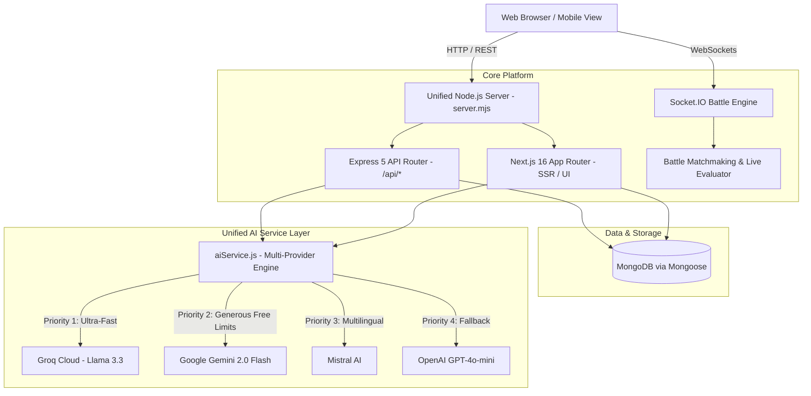

# Nova Learn 🚀

An AI-powered, gamified adaptive learning and battle platform built with **Next.js 16 (App Router)**, **Express 5**, **Socket.IO**, **MongoDB**, and an **Ultra-Fast Multi-Provider AI Engine** (Groq, Google Gemini, Mistral AI, OpenAI).

[](Dockerfile)
[](https://nextjs.org)
[](https://react.dev)
[](https://expressjs.com)
[](https://socket.io)
[](#multi-provider-ai-engine)

---

## 🌟 Overview

**Nova Learn** transforms traditional online education into an engaging, adaptive, and competitive experience. It combines real-time multiplayer coding and knowledge battles, intelligent curriculum generation, cognitive study therapy, spaced-repetition flashcards, and verified digital certificates in a single full-stack architecture.

---

## ⚡ Key Features

### 1. 🤖 Ultra-Fast Multi-Provider AI Engine
- **Sub-second Latency (<1s)**: Powered by fast frontier models (**Groq Llama 3.3 70B**, **Gemini 2.0 / 1.5 Flash**, **Mistral Small**, and **GPT-4o-mini**).
- **Auto-Detection & Automatic Fallback**: Drop in any API key (`GROQ_API_KEY`, `GEMINI_API_KEY`, `MISTRAL_API_KEY`, `OPENAI_API_KEY`). If one provider is rate-limited (HTTP 429) or unavailable, Nova Learn automatically fails over to the next available provider.
- **Fail-Safe JSON Engine**: Specialized sanitizer that strips markdown fences (````json ... ````), normalizes smart quotes, fixes trailing commas, and recovers corrupted outputs with JSON5.

### 2. ⚔️ Real-Time Live Battles (Socket.IO)
- **1v1 Competitive Arena**: Real-time matchmaking queues for students to battle on curriculum topics.
- **Hybrid Grading**: Instant validation for multiple-choice questions (MCQ) combined with real-time AI semantic grading for written paragraph explanations.
- **Live Leaderboards**: Global and weekly rankings based on XP, streaks, and focus metrics.

### 3. 🗺️ Autonomous Curriculum & Course Generation
- **Topic-to-Course**: Turn any topic into a 6-module course with lesson plans, practice questions, and milestones.
- **YouTube Playlist / Video Extractor**: Automatically extract video timestamps, outlines, and structured quizzes from YouTube educational videos.

### 4. 🧠 Adaptive Study Companion & AI Therapist
- **Socratic & Adaptive Tutoring**: Study tutor capable of switching between Socratic dialogue, analogy-based explanations, ELI5 (explain like I'm 5), and code-first modes.
- **Burnout & Focus Detection**: Analyzes study session durations, quiz performance trends, and streaks to recommend breaks, motivational messages, and Pomodoro adjustments.
- **Smart Hints**: 3-stage progressive hinting system (Subtle Clue → Partial Formula → Full Solution).

### 5. 🗂️ Spaced Repetition Flashcards (SM-2 Algorithm)
- Scientific spaced-repetition algorithm that calculates review intervals and optimal ease factors based on recall quality ratings.

### 6. 📜 Blockchain-Verified Certificates
- Mint verifiable certificates for course and quiz milestones with verifiable hashes.

---

## 🏗️ System Architecture

Nova Learn uses a hybrid full-stack architecture designed for real-time responsiveness and seamless SSR/SSG:



---

## 🛠️ Tech Stack

- **Frontend**: Next.js 16.2 (Turbopack, React 19), Tailwind CSS v4, Radix UI primitives, Framer Motion, GSAP, Lucide Icons, Sonner.
- **Backend**: Express 5, Node.js HTTP Server, Socket.IO 4.8.
- **Database**: MongoDB 7.0 via Mongoose 9.4 with connection pooling.
- **Authentication**: JWT (`jsonwebtoken`) + HTTP-only cookies + bcryptjs.
- **AI / LLM Integration**: `@google/generative-ai`, `groq-sdk`, `@mistralai/mistralai`, `openai`, `json5`.
- **DevOps & Containerization**: Docker (multi-stage Alpine), Docker Compose.

---

## 🚀 Deployment Guide

### Option 1: Docker Container (Recommended)

Docker is the **recommended production target** because it runs the complete unified application in a single container—including the Next.js frontend, Express API routes, persistent MongoDB connection, and Socket.IO WebSockets for live coding battles.

#### 1. Setup Environment
Copy the example environment file:
```bash
cp .env.example .env
```
Open `.env` and add your database URI and any AI API keys (e.g., `GROQ_API_KEY` or `GEMINI_API_KEY`).

#### 2. Run with Docker Compose
```bash
# Build and run the entire stack (App + MongoDB) in background
docker compose up --build -d

# Check running status
docker compose ps

# View live application logs
docker compose logs -f app
```
The application will be live at `http://localhost:3000`.

#### 3. Deploy to Cloud Container Platforms
You can deploy this Docker container with zero modification to:
- **Railway**: Connect your repo, select Docker deployment, add environment variables in the settings.
- **Render**: Create a "Web Service", select Docker runtime.
- **Fly.io**: Run `fly launch` using the included `Dockerfile`.
- **DigitalOcean App Platform**: Select "Dockerfile" as the build method.
- **Any VPS (Ubuntu/Debian)**: Clone repo, configure `.env`, run `docker compose up -d`.

---

### Option 2: Deploy to Vercel

If you prefer deploying the frontend and serverless API endpoints to Vercel:

1. Push your code to GitHub.
2. Import the project in [Vercel](https://vercel.com/new).
3. In **Project Settings → Environment Variables**, add:
   - `MONGO_URI` (or `MONGODB_URI` from MongoDB Atlas)
   - `JWT_SECRET`
   - `GROQ_API_KEY` or `GEMINI_API_KEY` or `MISTRAL_API_KEY`
4. Click **Deploy**.

> **Note on Vercel**: Vercel runs in a serverless environment and does not support persistent WebSocket connections. All Next.js pages, study dashboard, quizzes, roadmaps, flashcards, and AI tutor features work seamlessly on Vercel. For live multiplayer battles via Socket.IO, deploy using the Docker container.

---

## 🔧 Environment Variables Reference

| Variable | Required | Description | Example |
| :--- | :---: | :--- | :--- |
| `MONGO_URI` | **Yes** | MongoDB connection string (or `MONGODB_URI`) | `mongodb://127.0.0.1:27017/nova_learn` |
| `JWT_SECRET` | **Yes** | Secret string for signing auth tokens | `a_super_strong_random_secret` |
| `ADMIN_JWT_SECRET` | No | Secret string for admin JWT tokens | `admin_super_secret` |
| `GROQ_API_KEY` | Optional* | Groq API Key (recommended for <1s latency) | `gsk_...` |
| `GEMINI_API_KEY` | Optional* | Google Gemini API Key | `AIzaSy...` |
| `MISTRAL_API_KEY` | Optional* | Mistral AI API Key | `...` |
| `OPENAI_API_KEY` | Optional* | OpenAI API Key | `sk-proj-...` |
| `PORT` | No | Server port (defaults to 3000) | `3000` |
| `NODE_ENV` | No | Runtime environment (`production` / `development`) | `production` |

*\*At least ONE AI provider key should be supplied for AI features to function.*

---

## 💡 Engineering Challenges & Solutions

### 1. High Latency & Provider Lock-in with Frontier LLMs
- **The Challenge**: The original code was hardcoded to `mistral-large-latest` across 20+ controllers. Every request took 10–25 seconds to generate, often exceeding Vercel's hobby execution timeout (10s) and hitting rate limits (HTTP 429). Furthermore, if Mistral was down or the key was missing, the entire AI system crashed even though Groq, Gemini, and OpenAI SDKs were installed.
- **The Solution**: Built a centralized AI abstraction layer ([src/lib/aiService.js](src/lib/aiService.js)). It defaults to blazing fast, lightweight models (`llama-3.3-70b-versatile` on Groq, `gemini-2.0-flash`, or `mistral-small-latest`), dropping response latency from 15s to **under 1 second**. It dynamically detects all configured keys and automatically retries across secondary providers if the primary provider fails.

### 2. Brittle JSON Outputs from LLMs
- **The Challenge**: AI-generated quizzes, roadmaps, and daily tasks frequently returned Markdown fences (````json ... ````), conversational preambles ("Here is your JSON:"), or trailing commas before closing brackets, crashing standard `JSON.parse`.
- **The Solution**: Implemented `extractAndParseJSON` in `aiService.js`. It extracts balanced `{ ... }` or `[ ... ]` blocks, strips markdown, normalizes typographical quotes, removes trailing commas, and uses JSON5 for relaxed parsing with fallback recovery.

### 3. Linux & Docker Case-Sensitivity Conflicts
- **The Challenge**: On Windows, file paths are case-insensitive, so imports like `import User from '../Models/User.js'` worked locally. When built in Linux Docker containers or on cloud hosts, Node threw fatal `Cannot find module '../Models/User.js'` errors because the actual folder was named `models/`.
- **The Solution**: Audited and refactored all import statements to strict lowercase across the socket manager and all Express controllers.

### 4. Database Connection Timing During Next.js Static Compilation
- **The Challenge**: `src/lib/db.js` had a top-level `throw new Error` executed at import time if `MONGO_URI` was not defined. When `next build` pre-renders pages at compile time in CI/CD without a live database, this crashed the build.
- **The Solution**: Refactored `dbConnect` to lazily resolve the URI at execution time, supporting both `MONGO_URI` and `MONGODB_URI` conventions, allowing `next build` to compile statically with 0 errors.

### 5. Docker Host Networking
- **The Challenge**: Node's HTTP server was listening on `localhost` by default, which prevented external traffic routed through Docker port mapping (`-p 3000:3000`) from accessing the container.
- **The Solution**: Bound the server explicitly to `0.0.0.0:${PORT}` in `server.mjs`.

---

## 💻 Local Development

### Prerequisites
- Node.js 20+ (Node.js 24 supported)
- MongoDB instance (local or MongoDB Atlas)

### Steps
```bash
# 1. Install dependencies
npm install

# 2. Copy and populate .env
cp .env.example .env

# 3. Start development server (Next.js + Express + Socket.IO)
npm run dev

# 4. Run production build test
npm run build

# 5. Start production server locally
npm start
```

---

## 📜 License
This project is open source and available under the [MIT License](LICENSE).
